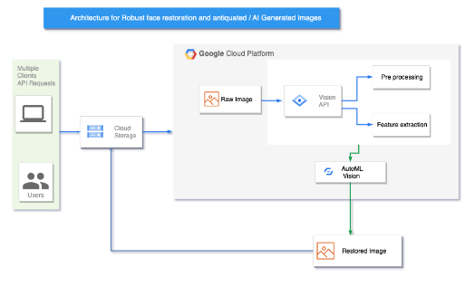

  

Project summary:
This project focuses on the image restoration of old and tampered images along with this it also focuses on AI Generated Images. 
•What are the challenges of this project?
Image processing and analysis: Face restoration often involves complex image processing and analysis algorithms that can be computationally intensive and require significant computational resources. 
Scalability and reliability: A web-based face restoration program needs to be scalable and reliable, as it is expected to handle a large number of requests from users.
Performance optimization: Optimizing the performance of a web-based face restoration program can be difficult, as it requires balancing the trade-offs between accuracy, speed, and resource utilization. 
User experience: The user experience is an important factor in the success of a web-based face restoration program, as users expect a fast and reliable service that provides high-quality results.
•What cloud services do you expect to use ?
PaaS - App Engine 
Google cloud functions
Cloud Storage
•What data or other resources are you going to use ?
Data - We will use different pictures that might have blurriness , discoloration , cropped and aligned faces (Image enhancement) available on the web.
•What reading will you explore to provide context and background? If relevant, what papers do you refer to?
Context & background : We have found a few papers which were used as references
Paper reference :
https://www.semanticscholar.org/paper/GLEAN%3A-Generative-Latent-Bank-for-Large-Factor-Chan-Wang/18bf61eb27c146f8e11ea0590c9b6787d8274ce6
https://arxiv.org/pdf/2203.08444.pdf
https://arxiv.org/pdf/2005.05005.pdf
•How will you evaluate your results?
Processing time for images (Speed of the program)
Accuracy of outputs.
Collect and label data: Collect a set of data (e.g., images of faces) and label it with ground-truth information (e.g., the original appearance of the face).
•What references you plan to use. ( github repos, etc)?
github repo - ( https://github.com/TencentARC/GFPGAN)
Stackoverflow (https://stackoverflow.blog/2021/06/14/lets-enhance-use-intel-ai-to-increase-image-resolution-in-this-demo/)
gray literature/papers with similar functional code - (https://paperswithcode.com/paper/blind-face-restoration-via-deep-multi-scale) 
•What demo do you expect to show at the end of term?

A functioning web application with an image restoration algorithm showcasing a set of images that were obtained as a result. ( original Vs restored ) 

Data gathering: The first stage is to gather a sizable dataset of old or artificial intelligence (AI)-generated photographs. The face restoration algorithm will be trained using the provided dataset. To guarantee that the algorithm is capable of handling a wide range of image quality and style, the dataset should contain photos from many sources and historical periods.
Pre-processing:  is necessary to get rid of any noise or artifacts that can impede the restoration process from the gathered dataset. Noise reduction, color balance, and image resizing could all be included in this step.
Feature Extraction: Extraction of features from the photos is the following stage. This step entails recognizing important face characteristics like the mouth, nose, and eyes. Computer vision techniques like face detection and landmark detection are used to extract the features.
Image restoration: The image is restored using the features that were extracted. At this step, convolutional neural networks (CNNs), a deep learning approach, are used to forecast missing or damaged portions of the image. The pre-processed dataset is used to train the CNNs on how to restore the images.

